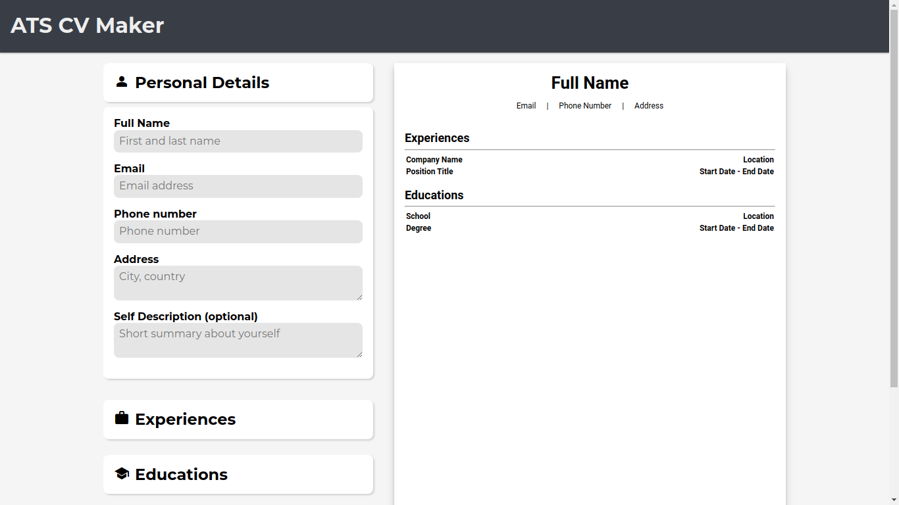

# ATS CV Maker

An ATS CV maker website helps job seekers create resumes optimized for Applicant Tracking Systems (ATS). It formats resumes to ensure compatibility with ATS software, increasing the chances of passing initial screenings and landing job interviews.

## Demo

[Link to live demo](https://cv-maker-alpha-two.vercel.app/)

## Built With

- React

## Authors

- Github: [@fahryanputra](https://www.github.com/fahryanputra)
- Email: [fahryandi.herlasmara@gmail.com](fahryandi.herlasmara@gmail.com)

## Acknowledgements

- [Google Font](https://fonts.google.com/)
- [Google Icons](https://fonts.google.com/icons)
